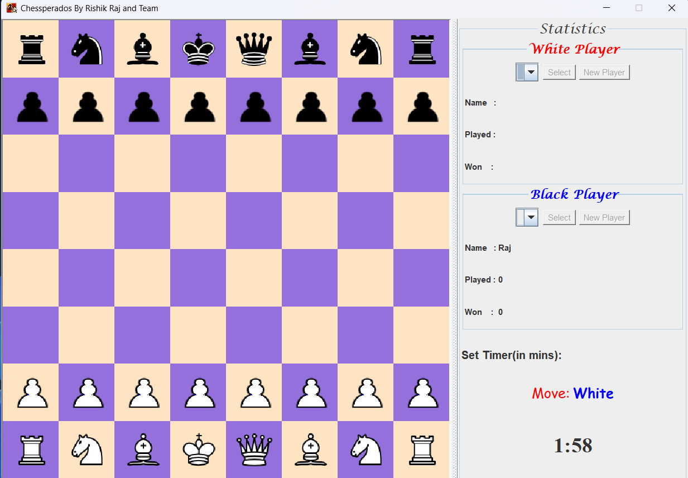
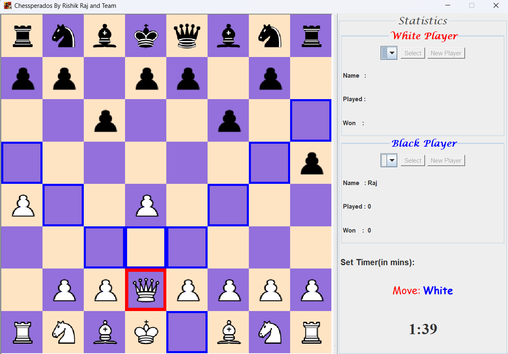

# Chessperados

This is a windows application of a chess game built in Java and Java Swing by Rishik Raj and team members Saurav Sinha, Shivank, and Samir Chaudhary as part of our 4th semester project work.  The game can be played by two players by selecting their names and maximum time for each move. Players can select any piece from the chess board to move according to the rules of chess. As a player selects any piece, all the possible moves will be highlighted, and the player can move to any of the highlighted squares. The game will either be won by any of the players or will end in a draw because the king has no place to move.

## Table of Contents

- [Chess Game](#chess-game)
  - [Table of Contents](#table-of-contents)
  - [Installation](#installation)
  - [Usage](#usage)
  - [Features](#features)
  - [Technologies Used](#technologies-used)
  - [Contributing](#contributing)
  - [License](#license)

## Installation

To install and run the game, follow these steps:

1. Clone the repository to your local machine using `git clone https://github.com/rishikraj990/Chessperados.git`.
2. Navigate to the project directory.
3. Compile the Java source files using `javac *.java`.
4. Run the game using `java Main`.

## Usage

Once the game is running, players can select their names and maximum time for each move. Players can then make moves by selecting a piece and then selecting one of the highlighted squares to move the piece to. The game will end when one of the players wins or when the game is drawn because the king has no place to move.

## Features

The following features are available in the game:

- Two players can play the game.

- Players can select their names and maximum time for each move.

- Players can move any piece according to the rules of chess.

- All the possible moves for a selected piece are highlighted.

- The game ends when one of the players wins or when the game is drawn.

## Technologies Used

The following technologies were used in the development of this project:

- Java
- Java Swing

## Contributing

Contributions to the project are welcome. To contribute, follow these steps:

1. Fork the repository.
2. Create a new branch for your changes.
3. Make your changes and commit them with a descriptive commit message.
4. Push your changes to your forked repository.
5. Submit a pull request to the original repository with a description of your changes.

## License

This project is licensed under the MIT License. See the `LICENSE` file for more information.
